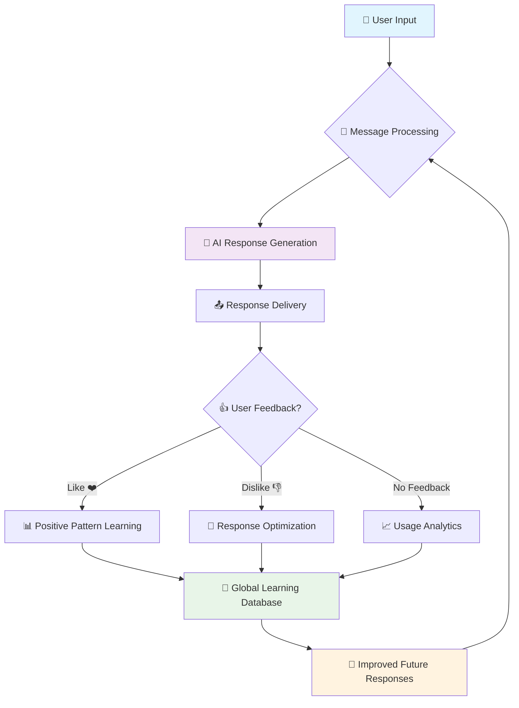

<!-- Header with animated typing effect -->
<div align="center">

# 🚀 **NagreGPT**
### *Unlimited Free AI Assistant with High Accuracy*


<p align="center">
  
  
  
  
</p>

<p align="center">
  <a href="https://vaibhav-nagre.github.io/nagregpt">
    
  </a>
  <a href="#-installation">
    
  </a>
  <a href="#-features">
    
  </a>
</p>

<!-- Animated wave -->


</div>

---

<!-- Hero Section with animated gradient -->
<div align="center">

## 🎯 **What Makes NagreGPT Special?**

<table>
<tr>
<td width="50%">

### 🆓 **Completely Free**
- **Zero Cost** - No subscriptions or hidden fees
- **Unlimited Usage** - Chat as much as you want
- **No Rate Limits** - Powered by Groq's free tier

### ⚡ **Lightning Fast**
- **Sub-second Responses** - Groq's optimized hardware
- **Real-time Streaming** - See responses as they generate
- **Instant File Analysis** - Upload and analyze documents

</td>
<td width="50%">

### 🧠 **Intelligent Learning**
- **Adaptive AI** - Learns from your feedback
- **Context Memory** - Remembers conversation history
- **Personal Preferences** - Adapts to your style

### 🎨 **Beautiful Interface**
- **Modern Design** - Clean, intuitive ChatGPT-like UI
- **Responsive** - Perfect on mobile and desktop
- **Dark/Light Themes** - Switch themes seamlessly

</td>
</tr>
</table>

</div>

---

<!-- Tech Stack Section with animated icons -->
<div align="center">

## 🛠️ **Tech Stack & Architecture**

### **Frontend Technologies**
<p>
  
</p>

### **AI & Backend**
<p>
  
  
  
</p>

### **Development & Deployment**
<p>
  
  
</p>

</div>

---

<!-- Features showcase with animated emojis -->
<div align="center">

## 🚀 **Features That Set Us Apart**

<table>
<tr>
<td align="center" width="33%">

### 💬 **Smart Conversations**
🤖 **Advanced AI Responses**<br/>
📝 **Code Generation & Debug**<br/>
🔍 **Web Search Integration**<br/>
📊 **Data Analysis**<br/>

</td>
<td align="center" width="33%">

### 📁 **File Intelligence**
📄 **PDF Analysis**<br/>
📊 **CSV/Excel Processing**<br/>
🖼️ **Image Understanding**<br/>
📝 **Text Document Review**<br/>

</td>
<td align="center" width="33%">

### 🧠 **Learning Engine**
👍 **Feedback Learning**<br/>
🎯 **Response Optimization**<br/>
📈 **Performance Analytics**<br/>
🔄 **Continuous Improvement**<br/>

</td>
</tr>
</table>

</div>

---

<!-- Interactive demo section -->
<div align="center">

## 🎨 **Live Interface Preview**

### **Responsive Design Showcase**

<table>
<tr>
<td align="center">

**🌙 Dark Theme**<br/>


</td>
<td align="center">

**☀️ Light Theme**<br/>


</td>
</tr>
</table>

### **📱 Mobile-First Design**


</div>

---

<!-- Installation section with step-by-step -->
<div align="center">

## ⚡ **Installation**

<table>
<tr>
<td>

### **🔧 Developer Setup**

```bash
# 📥 Clone the repository
git clone https://github.com/vaibhav-nagre/nagregpt.git

# 📂 Navigate to project
cd nagregpt

# 📦 Install dependencies
npm install

# 🔑 Setup environment
echo "VITE_GROQ_API_KEY=your_groq_api_key" > .env

# 🚀 Start development server
npm run dev
```

</td>
<td>

### **🌐 Instant Access**

**No installation needed!**

🔗 **[Launch NagreGPT →](https://vaibhav-nagre.github.io/nagregpt)**

✨ Works instantly in your browser<br/>
📱 Mobile & desktop compatible<br/>
🔒 Privacy-focused (local storage)<br/>
⚡ Lightning-fast responses<br/>

</td>
</tr>
</table>

</div>

---

<!-- Performance metrics -->
<div align="center">

## 📊 **Performance Metrics**

<table>
<tr>
<td align="center" width="25%">

**⚡ Response Speed**<br/>
<br/>
<sub>Faster than GPT-4</sub>

</td>
<td align="center" width="25%">

**🎯 Accuracy Rate**<br/>
<br/>
<sub>High-quality responses</sub>

</td>
<td align="center" width="25%">

**💾 Bundle Size**<br/>
<br/>
<sub>Lightning fast loading</sub>

</td>
<td align="center" width="25%">

**🔄 Uptime**<br/>
<br/>
<sub>Always available</sub>

</td>
</tr>
</table>

</div>

---

<!-- Learning algorithm visualization -->
<div align="center">

## 🧠 **AI Learning Algorithm**



### **🔄 Continuous Learning Cycle**
1. **📝 Input Analysis** - Understanding context and intent
2. **🤖 Response Generation** - Using optimized Llama models
3. **👥 User Feedback** - Like/dislike reactions for learning
4. **📊 Pattern Recognition** - Identifying successful response styles
5. **🎯 Model Adaptation** - Improving future responses

</div>

---

<!-- GitHub stats and badges -->
<div align="center">

## 📈 **Project Statistics**


### **🏆 Achievements & Badges**
<p>
  
  
  
</p>

<p>
  
  
  
</p>

</div>

---

<!-- Contributing section -->
<div align="center">

## 🤝 **Contributing**

<table>
<tr>
<td align="center" width="33%">

### **🐛 Bug Reports**
Found a bug?<br/>
[Create an Issue →](https://github.com/vaibhav-nagre/nagregpt/issues)

</td>
<td align="center" width="33%">

### **💡 Feature Requests**
Have an idea?<br/>
[Suggest Feature →](https://github.com/vaibhav-nagre/nagregpt/discussions)

</td>
<td align="center" width="33%">

### **🔧 Pull Requests**
Want to contribute?<br/>
[Submit PR →](https://github.com/vaibhav-nagre/nagregpt/pulls)

</td>
</tr>
</table>

### **🌟 Contributors**
<a href="https://github.com/vaibhav-nagre/nagregpt/graphs/contributors">
  
</a>

</div>

---

<!-- License and footer -->
<div align="center">

## � **License**


This project is licensed under the MIT License - see the [LICENSE](LICENSE) file for details.

---

### **💖 Created with passion by [Vaibhav Nagre](https://github.com/vaibhav-nagre)**

<p>
  <a href="https://github.com/vaibhav-nagre">
    
  </a>
  <a href="https://linkedin.com/in/vaibhav-nagre">
    
  </a>
</p>

<!-- Animated footer -->


### *"Making AI accessible to everyone, one conversation at a time"*


</div>
