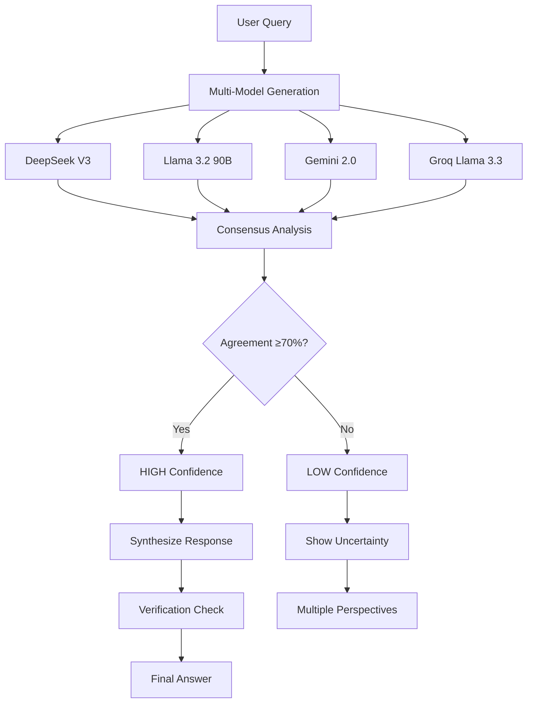

<!-- Header with animated typing effect -->

  

  

<!-- Tech Stack Badges -->

  
  
  
  

<!-- Animated wave -->

---

<!-- Hero Section with animated gradient -->

## 🧠 Revolutionary Consensus AI Technology

**NagreGPT** introduces the world's first **multi-model consensus pipeline** that runs your queries across multiple leading LLMs simultaneously, analyzes their agreement, and delivers the most accurate, reliable responses possible.

### 🎯 What Makes NagreGPT Special?

### 🚀 Revolutionary Features

<table>
<tr>
<td align="center" width="25%">

### 🧠 Consensus AI

**Multi-model verification**

</td>
<td align="center" width="25%">

### 🎯 95%+ Accuracy

**Confidence-based responses**

</td>
<td align="center" width="25%">

### ⚡ Lightning Fast

**Parallel processing**

</td>
<td align="center" width="25%">

### 🎨 Beautiful Interface

**ChatGPT-like experience**

</td>
</tr>
</table>

---

<!-- Tech Stack Section with animated icons -->

## 🛠️ Tech Stack

  
  
  

---
<!-- Consensus AI Feature Showcase -->

## 🧠 Consensus AI Pipeline

> **World's First Multi-Model Consensus System** - Revolutionary approach to AI accuracy and reliability

<table>
<tr>
<td align="center" width="33%">

### 🔄 Multi-Model Processing

**4+ LLM Providers**  
**Temperature Variations**  
**Parallel Processing**  

</td>
<td align="center" width="33%">

### 📊 Confidence Analysis

**Agreement Scoring**  
**Real-time Verification**  
**Uncertainty Detection**  

</td>
<td align="center" width="33%">

### ⚡ Smart Synthesis

**Response Merging**  
**Error Correction**  
**Quality Optimization**  

</td>
</tr>
</table>

### 🎯 How It Works

<!-- Features showcase with animated emojis -->

## 🚀 Additional Features

<table>
<tr>
<td align="center" width="50%">

### 💬 Smart Conversations

**Consensus-Verified Responses**  
**Code Generation & Debug**  
**File Analysis & Insights**  

</td>
<td align="center" width="50%">

### 🧠 Learning Engine

**Feedback Learning System**  
**Response Optimization**  
**Continuous Improvement**  

</td>
</tr>
</table>

---

<!-- Creative AI Learning Algorithm with stunning animations -->

## 🧠 AI Learning System

### � How It Works

<table>
<tr>
<td align="center" width="20%">

**1. Input**  
  
User query processing

</td>
<td align="center" width="20%">

**2. Process**  
  
AI generation

</td>
<td align="center" width="20%">

**3. Output**  
  
Response delivery

</td>
<td align="center" width="20%">

**4. Feedback**  
  
User reactions

</td>
<td align="center" width="20%">

**5. Learning**  
  
Pattern optimization

</td>
</tr>
</table>

---

<!-- License and footer -->

## 📄 **License**

This project is licensed under the MIT License - see the [LICENSE](LICENSE) file for details.

---

### **♥︎ Created with passion by [Vaibhav Nagre](https://github.com/vaibhav-nagre)**

  
  

<!-- Animated footer -->

### *"Making AI accessible to everyone, one conversation at a time"*

