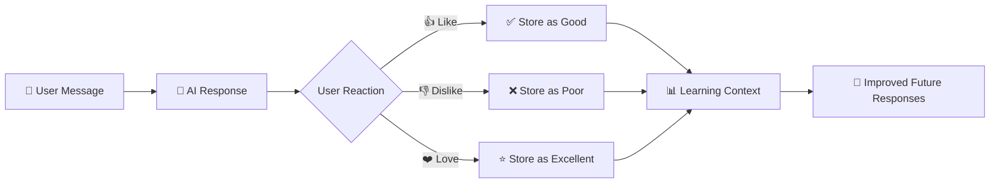

# 🌟 NagreGPT

<div align="center">


### ✨ A pixel-perfect ChatGPT clone with advanced AI learning capabilities

[🚀 Live Demo](https://vaibhav-nagre.github.io/nagregpt) • [📖 Documentation](#features) • [🛠️ Setup](#installation)

</div>

---

## 🎯 **What is NagreGPT?**

> A beautiful, intelligent chat interface that learns from your interactions and provides contextual responses using the **Groq API** with **Llama models**.


---

## 🚀 **Quick Start**

```bash
# Clone the repository
git clone https://github.com/vaibhav-nagre/nagregpt.git

# Navigate to project
cd nagregpt

# Install dependencies
npm install

# Add your Groq API key
echo "VITE_GROQ_API_KEY=your_api_key_here" > .env

# Start development server
npm run dev
```

<div align="center">

### 🎉 **That's it! Open `http://localhost:3000/nagregpt/` and start chatting!**

</div>

---

## 🛠️ **Tech Stack**

<div align="center">

| Frontend | Backend | AI/ML | Deployment |
|----------|---------|-------|------------|
| React 19 | Groq API | Llama Models | GitHub Pages |
| TypeScript | - | Learning Algorithm | Vite Build |
| Tailwind CSS | - | Context Memory | - |
| Vite | - | File Analysis | - |

</div>

---

## 📖 **How AI Learning Works**



The AI learns from your feedback patterns and adapts its response style to match your preferences!

---

## 🎨 **Screenshots**

<div align="center">

| Dark Theme | Light Theme |
|------------|-------------|
|  |  |

</div>

---

## 📊 **Project Stats**

<div align="center">


</div>

---

<div align="center">

### 💖 **Made with love by [Vaibhav Nagre](https://github.com/vaibhav-nagre)**


---

*Built with React, TypeScript, and lots of ☕*

</div>
