# 🌟 NagreGPT

<div align="center">


### ✨ A pixel-perfect ChatGPT clone with advanced AI learning capabilities

[🚀 Live Demo](https://vaibhav-nagre.github.io/nagregpt) • [📖 Documentation](#features) • [🛠️ Setup](#installation)

</div>

---

## 🎯 **What is NagreGPT?**

> A beautiful, intelligent chat interface that learns from your interactions and provides contextual responses using the **Groq API** with **Llama models**.

<details>
<summary>🎬 <strong>View Features</strong></summary>

### 🔥 **Core Features**
- 🎨 **Pixel-perfect ChatGPT UI** - Exact replica of chat.openai.com
- 🧠 **Smart Session Memory** - Remembers entire conversation context
- 📊 **AI Learning System** - Adapts based on your reactions (👍👎❤️)
- 🌓 **Dark/Light Themes** - Seamless theme switching
- 📁 **File Analysis** - Upload and analyze PDFs, logs, and documents
- 🎤 **Voice Integration** - Voice input and audio responses
- ⚡ **Real-time Streaming** - Live response generation
- 💫 **Smooth Animations** - Glassmorphism and modern effects

### 🎛️ **Advanced Features**
- ✏️ **Message Editing** - Edit and regenerate responses
- ⭐ **Reaction System** - Like, dislike, or love responses
- 📱 **Responsive Design** - Perfect on all devices
- 🔄 **Auto-save** - Never lose your conversations
- 🎯 **Focused Responses** - Concise, relevant answers

</details>

---

## 🚀 **Quick Start**

```bash
# Clone the repository
git clone https://github.com/vaibhav-nagre/nagregpt.git

# Navigate to project
cd nagregpt

# Install dependencies
npm install

# Add your Groq API key
echo "VITE_GROQ_API_KEY=your_api_key_here" > .env

# Start development server
npm run dev
```

<div align="center">

### 🎉 **That's it! Open `http://localhost:3000/nagregpt/` and start chatting!**

</div>

---

## 🛠️ **Tech Stack**

<div align="center">

| Frontend | Backend | AI/ML | Deployment |
|----------|---------|-------|------------|
| React 19 | Groq API | Llama Models | GitHub Pages |
| TypeScript | - | Learning Algorithm | Vite Build |
| Tailwind CSS | - | Context Memory | - |
| Vite | - | File Analysis | - |

</div>

---

## 📖 **How AI Learning Works**

```mermaid
graph LR
    A[👤 User Message] --> B[🤖 AI Response]
    B --> C{User Reaction}
    C -->|👍 Like| D[✅ Store as Good]
    C -->|👎 Dislike| E[❌ Store as Poor]
    C -->|❤️ Love| F[⭐ Store as Excellent]
    D --> G[📊 Learning Context]
    E --> G
    F --> G
    G --> H[🧠 Improved Future Responses]
```



The AI learns from your feedback patterns and adapts its response style to match your preferences!

---

## 🎨 **Screenshots**

<div align="center">

| Dark Theme | Light Theme |
|------------|-------------|
|  |  |

</div>

---

## 📊 **Project Stats**

<div align="center">


</div>

---

## 🤝 **Contributing**

We love contributions! Feel free to:

- 🐛 Report bugs
- 💡 Suggest features  
- 🔧 Submit pull requests
- ⭐ Star the repo

---

<div align="center">

### 💖 **Made with love by [Vaibhav Nagre](https://github.com/vaibhav-nagre)**

**[⭐ Star this repo](https://github.com/vaibhav-nagre/nagregpt)** • **[🐦 Follow on Twitter](https://twitter.com/vaibhavnagre)** • **[💼 LinkedIn](https://linkedin.com/in/vaibhavnagre)**

---

*Built with React, TypeScript, and lots of ☕*

</div>
