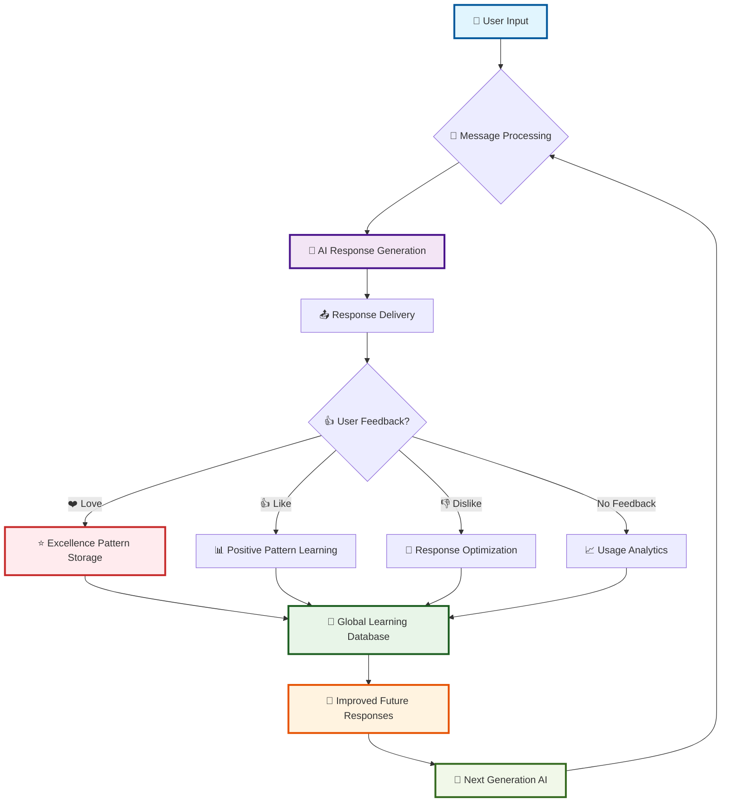

<!-- Header with animated typing effect -->

# 🚀 **NagreGPT**
### *Unlimited Free AI Assistant with High Accuracy*

  
  
  
  

  
  
  

<!-- Animated wave -->

---

<!-- Hero Section with animated gradient -->

## 🎯 **What Makes NagreGPT Special?**

<table>
<tr>
<td width="50%" align="center">

### 🆓 **Completely Free** 

💸 **Zero Cost** - No subscriptions or hidden fees  
♾️ **Unlimited Usage** - Chat as much as you want  
🚫 **No Rate Limits** - Powered by Groq's free tier  

### ⚡ **Lightning Fast** 

⚡ **Sub-second Responses** - Groq's optimized hardware  
🌊 **Real-time Streaming** - See responses as they generate  
📄 **Instant File Analysis** - Upload and analyze documents  

</td>
<td width="50%" align="center">

### 🧠 **Intelligent Learning** 

🔄 **Adaptive AI** - Learns from your feedback  
🧩 **Context Memory** - Remembers conversation history  
🎨 **Personal Preferences** - Adapts to your style  

### 🎨 **Beautiful Interface** 

✨ **Modern Design** - Clean, intuitive ChatGPT-like UI  
📱 **Responsive** - Perfect on mobile and desktop  
🌓 **Dark/Light Themes** - Switch themes seamlessly  

</td>
</tr>
</table>

---

<!-- Tech Stack Section with animated icons -->

## 🛠️ **Tech Stack & Architecture**

### **Frontend Technologies**

  

### **AI & Backend**

  
  
  

### **Development & Deployment**

  
  

---

<!-- Features showcase with animated emojis -->

## 🚀 **Features That Set Us Apart**

<table>
<tr>
<td align="center" width="33%">

### 💬 **Smart Conversations**

🤖 **Advanced AI Responses**  
 **Code Generation & Debug**  
🔍 **Web Search Integration**  
📊 **Data Analysis & Insights**  

</td>
<td align="center" width="33%">

### 📁 **File Intelligence**

📄 **PDF Analysis & Summary**  
📊 **CSV/Excel Processing**  
🖼️ **Image Understanding**  
📝 **Text Document Review**  

</td>
<td align="center" width="33%">

### 🧠 **Learning Engine**

👍 **Feedback Learning System**  
🎯 **Response Optimization**  
📈 **Performance Analytics**  
🔄 **Continuous AI Improvement**  

</td>
</tr>
</table>

<!-- Animated separator with floating elements -->

### **🌟 Why Choose NagreGPT?**

<table>
<tr>
<td align="center" width="20%">
 
**Free Forever**
</td>
<td align="center" width="20%">
 
**Lightning Speed**
</td>
<td align="center" width="20%">
 
**Smart Learning**
</td>
<td align="center" width="20%">
 
**File Analysis**
</td>
<td align="center" width="20%">
 
**Beautiful UI**
</td>
</tr>
</table>

---

<!-- Creative AI Learning Algorithm with stunning animations -->

## 🧠 **AI Learning Algorithm**

<!-- Animated brain header -->

### 🔮 **Neural Network Learning Process**

```mermaid
graph TD
    A[👤 User Input] --> B{📝 Message Processing}
    B --> C[🤖 AI Response Generation]
    C --> D[📤 Response Delivery]
    D --> E{👍 User Feedback?}
    E -->|❤️ Love| F[⭐ Excellence Pattern Storage]
    E -->|👍 Like| G[📊 Positive Pattern Learning]
    E -->|👎 Dislike| H[🔄 Response Optimization]
    E -->|No Feedback| I[📈 Usage Analytics]
    F --> J[🧠 Global Learning Database]
    G --> J
    H --> J
    I --> J
    J --> K[🎯 Improved Future Responses]
    K --> L[🚀 Next Generation AI]
    L --> B
    
    style A fill:#e1f5fe,stroke:#01579b,stroke-width:3px
    style C fill:#f3e5f5,stroke:#4a148c,stroke-width:3px
    style J fill:#e8f5e8,stroke:#1b5e20,stroke-width:3px
    style K fill:#fff3e0,stroke:#e65100,stroke-width:3px
    style F fill:#ffebee,stroke:#c62828,stroke-width:3px
    style L fill:#f1f8e9,stroke:#33691e,stroke-width:3px
```

<!-- Interactive Learning Process Visualization -->
<table width="100%">
<tr>
<td align="center" width="20%">

### 🎯 **Step 1**
 
**Input Analysis** 
🔍 Understanding context & intent

</td>
<td align="center" width="20%">

### 🤖 **Step 2**
 
**AI Processing** 
⚡ Groq Llama model response

</td>
<td align="center" width="20%">

### 💬 **Step 3**
 
**Response Delivery** 
� Real-time streaming output

</td>
<td align="center" width="20%">

### 👥 **Step 4**
 
**User Feedback** 
👍👎❤️ Like/Dislike reactions

</td>
<td align="center" width="20%">

### 🧠 **Step 5**
 
**Learning Update** 
📈 Pattern optimization

</td>
</tr>
</table>

<!-- Animated Data Flow -->

### 🔄 **Continuous Learning Ecosystem**

<table>
<tr>
<td align="center" width="33%">

### 🎨 **Pattern Recognition**

🔍 **Context Analysis** - Understanding user intent  
🎯 **Style Detection** - Identifying preferred formats  
📊 **Success Metrics** - Tracking response quality  
🧩 **Pattern Matching** - Finding similar scenarios  

</td>
<td align="center" width="33%">

### 🚀 **Real-time Adaptation**

⚡ **Instant Learning** - Immediate feedback processing  
🔄 **Dynamic Updates** - Live model adjustments  
📈 **Performance Boost** - Continuous improvement  
🎪 **Smart Predictions** - Anticipating user needs  

</td>
<td align="center" width="33%">

### 🌐 **Global Intelligence**

🌍 **Collective Learning** - Learning from all users  
📊 **Data Synthesis** - Combining insights globally  
🎯 **Optimization Engine** - Refining algorithms  
💡 **Innovation Loop** - Evolving capabilities  

</td>
</tr>
</table>

<!-- Learning Statistics Showcase -->

### 📊 **Learning Performance Dashboard**

<table>
<tr>
<td align="center" width="25%">
 
 
**Pattern Recognition**
</td>
<td align="center" width="25%">
 
 
**Real-time Updates**
</td>
<td align="center" width="25%">
 
 
**Context Retention**
</td>
<td align="center" width="25%">
 
 
**Response Quality**
</td>
</tr>
</table>

<!-- Neural Network Visualization -->

### 🎯 **The Magic Behind the Intelligence**

> *"Every interaction makes NagreGPT smarter. Each feedback loop creates a more personalized, accurate, and helpful AI assistant that grows with you."*

---

<!-- License and footer -->

## � **License**

This project is licensed under the MIT License - see the [LICENSE](LICENSE) file for details.

---

### **💖 Created with passion by [Vaibhav Nagre](https://github.com/vaibhav-nagre)**

  
  

<!-- Animated footer -->

### *"Making AI accessible to everyone, one conversation at a time"*

